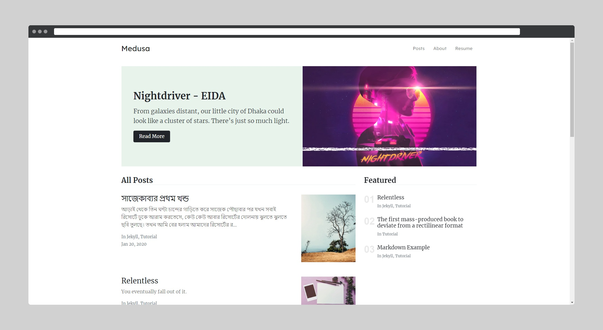

# Medusa Jekyll Theme

[Live Demo](https://wowthemesnet.github.io/mundana-theme-jekyll/) &nbsp; | &nbsp; 
[Download](https://github.com/wowthemesnet/mundana-theme-jekyll/archive/master.zip) &nbsp; | &nbsp; 

## What's new?

- ### About Page

    Added a new page called `about.html` in this theme. Where a profile page appears. This amazing blog theme is now a minimalized portfolio theme.

- ### New Fonts Added

    Added 'Merriweather' font for post content and 'Lexend Deca' for post title. Improves readibility.

    Hind Siliguri by Google Fonts has been added to this theme for supporting posts written in Bengali.
    In order to use the font, add `lang: bn` line to the top of markdown file of the post.

- ### Elegant Homepage

    Made some changes to the homepage of the previous Mundana Theme. It looks better now comparing to the previous one.

- ### Removed Unnecessary Fat

    Previously, it was more optimized for agency or online magazine. But now it can be used as a personal blog. Multiple author page has been deleted. Also comments has been deleted. Now, custom comment plugin can be used. Wish to introduce it next.

## Parent Theme
[Mundana Jekyll Theme](https://bootstrapstarter.com/bootstrap-templates/mundana-theme-jekyll/)

## Copyright
Theme mixed and mastered by [fazledyn](https://github.com/fazledyn), on Mundana Jekyll Theme developed by WowThemes.net.
Copyright 2020 under MIT License
